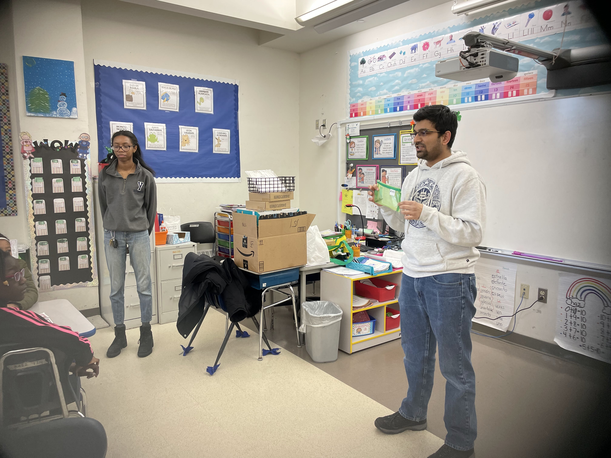

<!--StartFragment-->

Taught [Foldscope](https://foldscope.com) (cost-effective paper microscopes) to middle school children at Fair Haven School, New Haven, CT. They were excited to learn and took their own microscopes home. 

For the *quantitative* part of the microscopy, the students were introduced to calibration slides for calculating the actual sizes of samples. 

This project was funded by the MBL Alumni ROCS -Marine Biological Laboratory Regional Outreach and Communication in STEM.

<!--EndFragment-->

