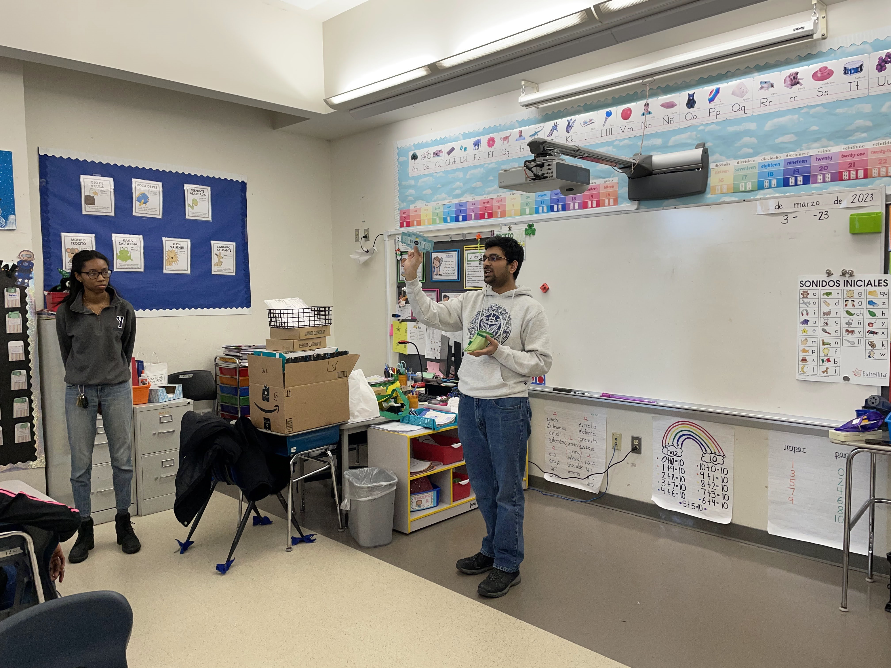

<!--StartFragment-->

Teaching tiny humans to look at the tiny world beyond the naked eye..

Taught [Foldscope](https://foldscope.com) (cost-effective paper microscopes) to middle school children at Fair Haven School, New Haven, CT. They were excited to learn and took their own microscopes home. 

This project was funded by the MBL Alumni ROCS -Marine Biological Laboratory Regional Outreach and Communication in STEM.

<!--EndFragment-->

